# Processes

The following processes describe the steps to create, read, update and delete documents in the attachment entity.
The attachment entity itself is handled by the CAP stack as it is a part of the data model.

## Create

The following overview shows the process of creating a new document inside the attachment entity.

### Success

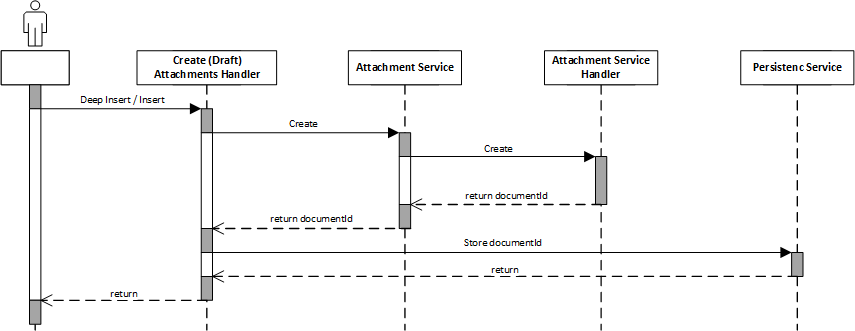

Independent of draft or no draft process the steps are the same, only the handler will be a different.
The handler will be listened to the event `CREATE` or `DRAFT_CREATE` and will be executed when the event is triggered.

The handler call the attachment service for the create event and the handler of the attachment service will
get the stream and process it.

### Error

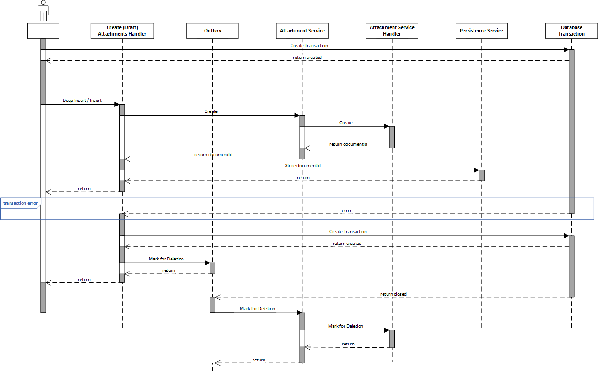

After an error occurred in the database transaction the create-handler will create a new transaction
and calls the outbox (attachment service as outboxed service) to mark the new created document as deleted

After the transaction is finished the outbox will take care to call the attachment service for the "mark as deleted"
event

## Delete

The following overview shows the process of deleting an existing document inside the attachment entity.
We will not delete the documents directly but only mark them as deleted.
The reason is that we had input from customers that a possible scenario could be, that do to bugs or other reasons
databases can be restored with the link to the documents.
If we would delete the documents directly the documents would be lost.

Because of this we only mark the documents as deleted. So the documents can be moved to a recycle bin or equal
concepts can be implemented.

If the database is restored an endpoint can be called to restore also the documents.

### Success

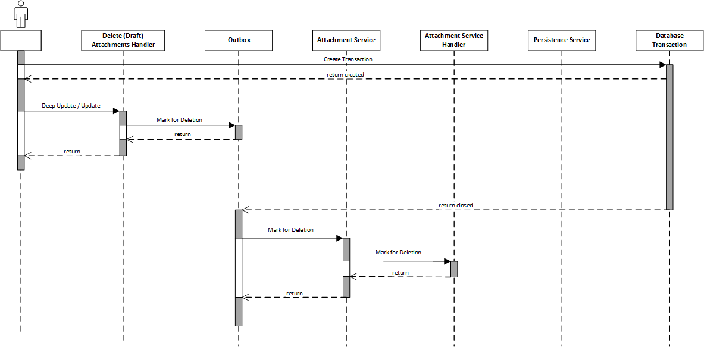

The delete-handler calls the outbox (attachment service as outboxed service) to mark the document as deleted.
After the transaction is finished the outbox will take care to call the attachment service for the "mark as deleted"
event.

### Error

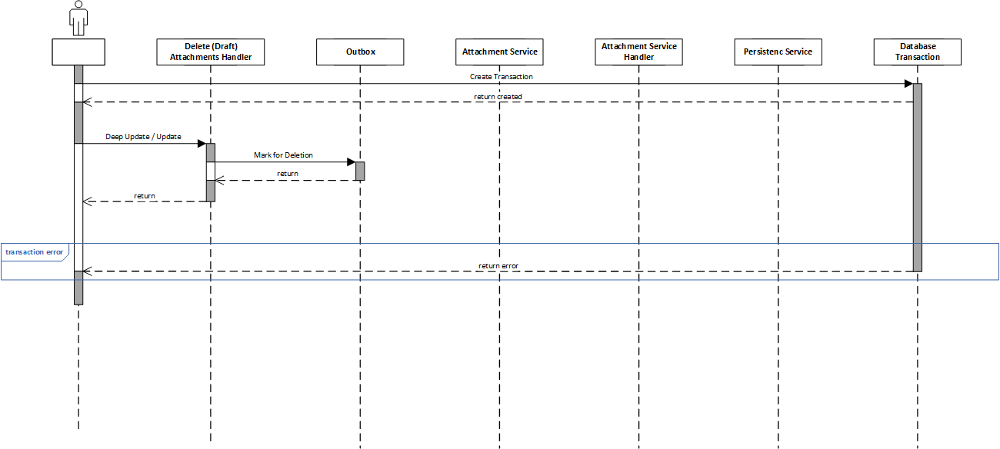

After the error occurs the outbox entry is rolled back and so the attachment service is never called
for marked as deleted and nothing needs to be done.

## Update

The following overview shows the process of updating an existing document inside the attachment entity.
The attachment service will not support an update, as this would be very difficult in terms of transactional
consistency.

### Success

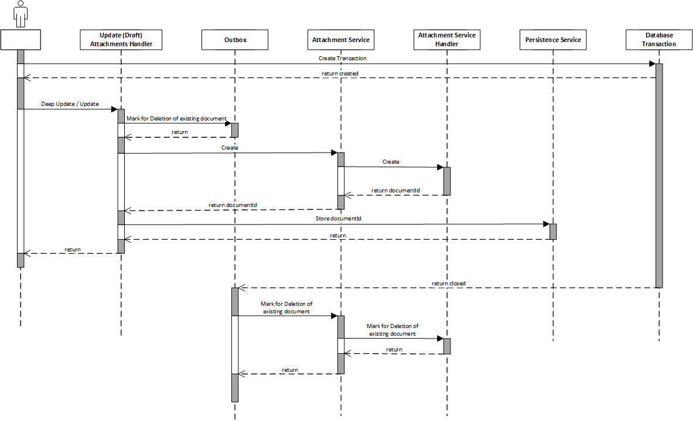

The update is implemented as delete and new create process.
First for the existing document the outbox will be called to mark the document as deleted.

After that the attachment service will be called for the create event.

### Error

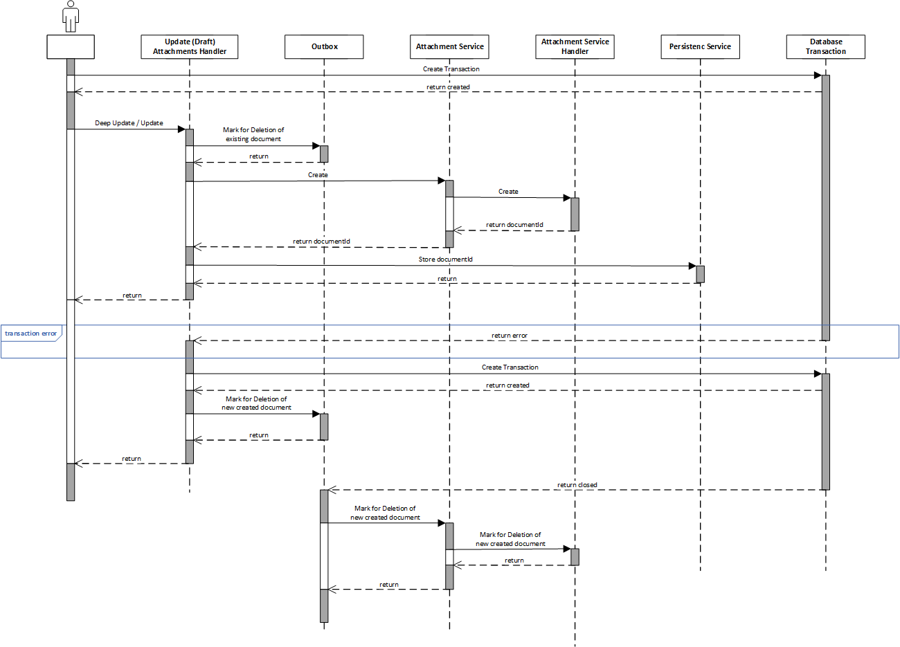

In case of errors and rollback of the database transaction the outbox for the deletion mark of the existing document
will not be persisted
and so nothing needs to be done here.
For the new created document the outbox needs to be called the mark the document as deleted.

## Activate Draft

The activate draft can be a mixture of create, update and delete.
The processes for the events will stay the same, the difference will be, that the
update handler needs to check if a document needs to be created, updated or deleted.

So the starting point is always the update handler.

## Discard Draft

The discard draft is the same as a deep delete.
The process for deletion of a document is the same as for the deletion, but handled in a discard draft handler.

## Restore Deleted Document

For restoring deletion marked documents customers needs to call an endpoint to trigger the restore process.
The endpoint will call a restore handler and the handler the restore event in the attachment service.

As input a timestamp is given which indicates which documents needs to be restored.
Every document which was marked as deleted after the given timestamp will be restored.

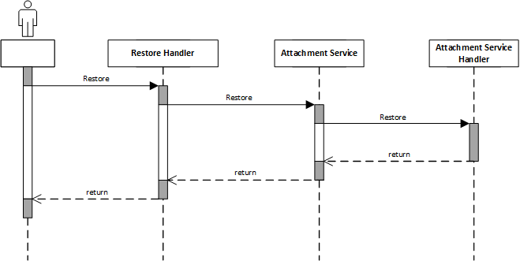

## Malware Scan

For uploaded documents a malware scan is needed.
Dependent on the attachment service handler implementation and the storage of the documents the malware scan can be done
in different ways.

For example the SAP Document Management Service (DMS) will scan the document on upload.
For storing the document on the database the malware scan needs to be called as external service.
To avoid bad performance for this call the malware scan will be called asynchronously.

Because the malware scan depends on the attachment service handler implementation it is called in the handler and not
before
calling the attachment service.

### Status

The attachment entity get a field `status` which indicates the status of the scan of the document.
The default value is `UNSCANNED`.
All possible status values are:

- `UNSCANNED`
- `SCANNING`
- `INFECTED`
- `CLEAN`
- `NO_SCANNER`

### Database Storage

For the attachment service default implementation which is database storage the malware scanner is
called during the create event.
The malware scanner is an outboxed service. So the scanning is called but executed asynchronously after the
current transaction is closed.

The service will read the attachment entity and with the document id the document using the attachment service.
After that the external malware scanner is called and the status of the document is updated.

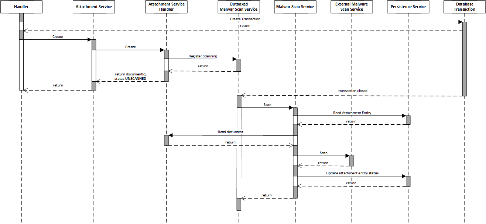

If there is no external scanner available the status will be set to `NO_SCANNER`.

## Read

Because some consumers of the read e.g. the Odata V4 adapter needs the information if
a document is available or not to show a link on the UI, and it needs this information in the content field a proxy for
the
InputStream was created.
The attachment handler will not return the InputStream directly, it will return a proxy object which
will forward the call to the attachment service if the bytes of the input stream are requested.

With this the content field is always filled with a stream object but not always a request to an external storage is
needed.

The proxy can also handle the check of the status if the attachment entity.
This check is implemented in the proxy for the following reasons:

- the check is not implemented in the read attachments handler, because if no access is needed e.g. for showing the link
  on the UI no error is thrown and users sees the link on the UI. Without the link user could wonder why there is no
  link even if they uploaded a document
- if there is access to the bytes of the stream an exception is thrown and potential problematic documents are not shown
  to the user
- the check is not implemented in the attachment service because:
    - every implementation of the attachment service handler needs to implement the check
    - the malware scan need to read the document without the check, because it needs the stream to scan the document

### Read including Access to the Document

The following sequence diagram shows the process of reading a document including access to the attachment service.

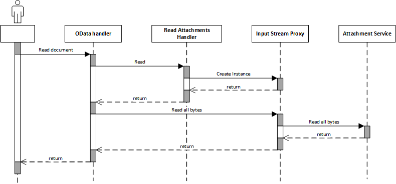

### Read without Access to the Document

The following sequence diagram shows the process of reading a document without access to the attachment service.

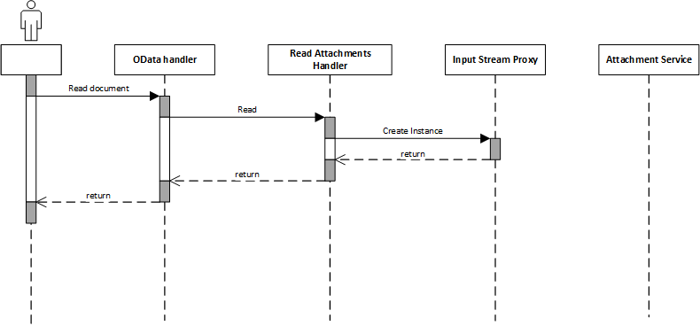

### Error because of Malware Scan Status

The following sequence diagram shows the process of reading a document with an error because of the malware scan status.

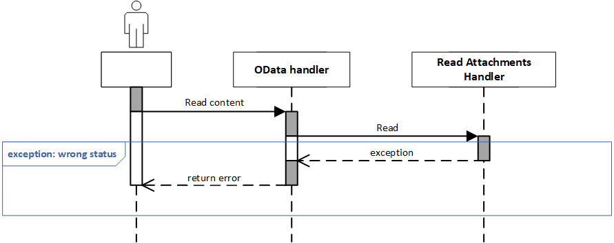

### No Scanner Available

If there is no malware scanner available, because there is no dependency to the malware scanner service,
the status will be set to `NO_SCANNER`.
In this case also an exception is thrown if the bytes of the stream are requested.

To give consumers the chance to anyway access the document an environment property is introduced:

- `cds.attachment.noScannerAccess` (default: `false`)

If it set to `true` the document can be accessed even if the status is `NO_SCANNER`. 