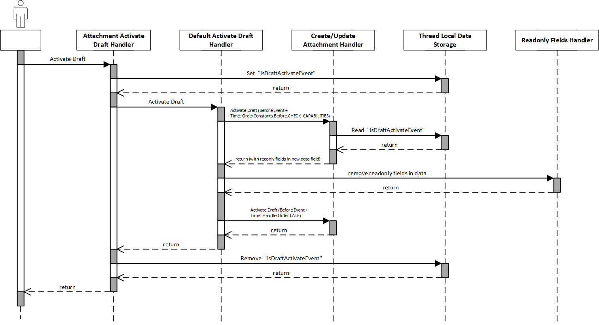

# Processes

The following processes describe the steps to create, read, update and delete contents in the attachment entity.
The attachment entity itself is handled by the CAP stack as it is a part of the data model.

The attachment service will have the following events. In this document it is described how these events are called.

- `CREATE`
- `MARK AS DELETED`
- `READ`
- `RESTORE DELETED`

The following chapters will describe the processes for user events and how this match to the attachment service events.

## Create

The following overview shows the process of creating a new content inside the attachment entity.

### Success

Independent of "draft" or "no draft" process, the steps are the same, only the handler will be a different.
The handler will be listened to the event `CREATE` or `DRAFT_CREATE` and will be executed when the event is triggered.

The handler call the attachment service for the create event and the handler of the attachment service will
get the stream and process it.

### Error

After an error occurred in the database transaction the create-handler will create a new transaction
and calls the outbox (attachment service as outboxed service) to mark the new created content as deleted

After the transaction is finished the outbox will take care to call the attachment service for the "mark as deleted"
event

## Delete

The following overview shows the process of deleting an existing content inside the attachment entity.
We will not delete the contents directly but only mark them as deleted.
The reason is that we had input from customers that a possible scenario could be, that do to bugs or other reasons
databases can be restored with the link to the contents.
If we delete the contents directly the contents would be lost.

Because of this we only mark the contents as deleted. So the contents can be moved to a recycle bin or equal
concepts can be implemented.

If the database is restored an endpoint can be called to restore also the contents.

In case of draft, the delete handler will not be called. It will only be called if the draft is activated.
If we call the deletion also for draft and the draft is cancelled we could not restore or unmark the content easily.

### Success

The delete-handler calls the outbox (attachment service as outboxed service) to mark the content as deleted.
After the transaction is finished the outbox will take care to call the attachment service for the "mark as deleted"
event.

### Error

After the error occurs the outbox entry is rolled back and so the attachment service is never called
for marked as deleted and nothing needs to be done.

## Update

The following overview shows the process of updating an existing content inside the attachment entity.
The attachment service will not support an update, as this would be very difficult in terms of transactional
consistency.

### Success

The update is implemented as delete and new create process.
First for the existing content the outbox will be called to mark the content as deleted.

After that the attachment service will be called for the create event.

### Error

In case of errors and rollback of the database transaction the outbox for the deletion mark of the existing content
will not be persisted
and so nothing needs to be done here.
For the new created content the outbox needs to be called the mark the content as deleted.

## Draft

Attachments are draft enabled. This means that attachments can be created, updated and deleted in draft mode.
In the draft mode the attachments are created and also here the attachment service is called for the create event.
The process for creation is the same as for the [create event](#create).

Same is true for the update event. The process for the update event is the same as for the [update event](#update).

The delete event is not called for draft. The delete event is only called if the draft is activated.
For this only the content id is deleted in the draft attachment entity.
If the draft is activated the delete event is called for the content id.

### Activate Draft

During activation of the draft attachment entity is read and for every content id which
is deleted in the draft entity but available in the active entity the delete event is called.

### Cancel Draft

If a draft is cancelled the created attachments in the draft entity will be deleted.
The cancel draft is the same as a deep delete.
The process for deletion of a content is the same as for the deletion, but handled in a discard draft handler.

### Readonly Fields

The following fields are readonly:

- `status`
- `scannedAt`
- `contentId`

As in the current implementation of the draft activate in the CAP Java stack all readonly fields are not copied to the
active entity some special logic needs to be implemented to save the readonly fields.

In the `CreateAttachmentHandler` and in the `UpdateAttachmentHandler` the readonly fields are stored in the data of the
events
in the attachment entity under the key `CREATE_READONLY_CONTEXT` but only the process is a draft activate process.
Otherwise, the key `CREATE_READONLY_CONTEXT` is cleared to avoid that the fields can be set from outside.

The handler are called again after the readonly fields are removed and can use the readonly fields from the
storage with key `CREATE_READONLY_CONTEXT`. The readonly fields are copied again in the data so that they will be stored
in the database.

The handler are called twice as the logic shall run in a late point in time to run after validation are executed.

## Restore Deleted content

For restoring deletion marked contents customers needs to call an endpoint to trigger the restore process.
The endpoint will call a restore handler and the handler the restore event in the attachment service.

As input a timestamp is given which indicates which contents needs to be restored.
Every content which was marked as deleted after the given timestamp will be restored.

## Malware Scan

For uploaded contents a malware scan is needed.
Dependent on the attachment service handler implementation and the storage of the contents the malware scan can be done
in different ways.

For example the SAP content Management Service (DMS) will scan the content on upload.
For storing the content on the database the malware scan needs to be called as external service.
To avoid bad performance for this call the malware scan will be called asynchronously.

Because the malware scan depends on the attachment service handler implementation it is called in the handler and not
before
calling the attachment service.

### Status

The attachment entity get a field `status` which indicates the status of the scan of the content.
The default value is `UNSCANNED`.
All possible status values are:

- `UNSCANNED`
- `INFECTED`
- `CLEAN`
- `NO_SCANNER`
- `FAILED`

### Database Storage

For the attachment service default implementation which is database storage the malware scanner is
called during the create event.
The malware scanner is an outboxed service. So the scanning is called but executed asynchronously after the
current transaction is closed.

The service will read the attachment entity and with the content id the content using the attachment service.
After that the external malware scanner is called and the status of the content is updated.

If there is no external scanner available the status will be set to `NO_SCANNER`.

## Read

Because some consumers of the read e.g. the Odata V4 adapter needs the information if
a content is available or not to show a link on the UI, and it needs this information in the content field a proxy for
the
InputStream was created.
The attachment handler will not return the InputStream directly, it will return a proxy object which
will forward the call to the attachment service if the bytes of the input stream are requested.

With this the content field is always filled with a stream object but not always a request to an external storage is
needed.

The proxy can also handle the check of the status if the attachment entity.
This check is implemented in the proxy for the following reasons:

- the check is not implemented in the read attachments handler, because if no access is needed e.g. for showing the link
  on the UI no error is thrown and users sees the link on the UI. Without the link user could wonder why there is no
  link even if they uploaded a content
- if there is access to the bytes of the stream an exception is thrown and potential problematic contents are not shown
  to the user
- the check is not implemented in the attachment service because:
    - every implementation of the attachment service handler needs to implement the check
  - the malware scan need to read the content without the check, because it needs the stream to scan the content

### Read including Access to the Content

The following sequence diagram shows the process of reading a content including access to the attachment service.

### Read without Access to the Content

The following sequence diagram shows the process of reading a content without access to the attachment service.

### Error because of Malware Scan Status

The following sequence diagram shows the process of reading a content with an error because of the malware scan status.

### No Scanner Available

If there is no malware scanner available, because there is no dependency to the malware scanner service,
the status will be set to `NO_SCANNER`.
In this case also an exception is thrown if the bytes of the stream are requested.

To give consumers the chance to anyway access the content an environment property is introduced:

- `cds.attachment.noScannerAccess` (default: `false`)

If it set to `true` the content can be accessed even if the status is `NO_SCANNER`. 